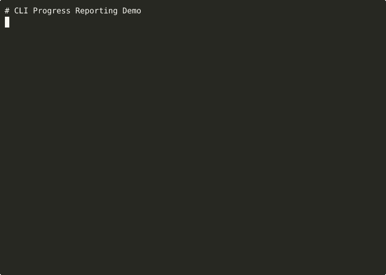

> **Part of [Tuulbelt](https://github.com/tuulbelt/tuulbelt)** — A collection of zero-dependency tools.

# CLI Progress Reporting / `prog`

[](https://github.com/tuulbelt/cli-progress-reporting/actions/workflows/test.yml)


[](LICENSE)

Concurrent-safe progress reporting for CLI tools with customizable templates and fluent API.

## What's New in v0.3.0

🚀 **Improved CLI Experience:**

- **🎯 Nested Command Structure** — Tracker ID comes first: `prog <id> <action>` instead of `prog <action> --id <id>`
- **📋 Formal Specification** — Complete SPEC.md documenting all behavior and invariants
- **🧹 Simplified Codebase** — Removed 195 lines of unnecessary backward compatibility code

**Breaking Change:** CLI syntax has changed to a more intuitive nested structure. Update your scripts:
```bash
# Old (no longer supported)
prog init --total 100 --id myproject

# New
prog myproject init 100
```

## What's New in v0.2.0

🎉 Major enhancements:

- **✨ Fluent Builder API** — Clean, chainable method syntax with `createProgress()`
- **🎨 Template System** — 7 built-in templates + custom template support
- **🔄 MultiProgress** — Track multiple progress states simultaneously
- **⏱️ ETA Calculation** — Automatic time-remaining estimation
- **🎭 Spinner Animations** — 5 built-in spinner sets (dots, line, arrows, box, clock)
- **📊 Progress Bars** — Customizable Unicode progress bars
- **📦 Object-Oriented API** — Modern class-based ProgressTracker
- **🔙 Backward Compatible** — Original functional API still works

**Test Coverage:** Expanded from 111 to 239 tests (116% increase) with zero flaky tests.

## Problem

When building CLI tools that process multiple items, you need a way to:
- Track progress across different processes or scripts
- Report progress updates safely from concurrent tasks
- Persist progress state that survives process crashes
- Query progress from separate monitoring scripts

Existing solutions require complex state management or don't handle concurrency well.

## Features

- **Zero runtime dependencies** — Uses only Node.js built-in modules
- **Concurrent-safe** — Atomic file writes prevent corruption
- **Persistent** — Progress survives process crashes and restarts
- **Multi-tracker** — Track multiple independent progress states simultaneously
- **Fluent API** — Modern builder pattern with method chaining
- **Customizable templates** — 7 built-in formats + custom template support
- **Multiple APIs** — Functional, object-oriented, and CLI interfaces
- **TypeScript** — Full type safety with strict mode

## Installation

Clone the repository:

```bash
git clone https://github.com/tuulbelt/cli-progress-reporting.git
cd cli-progress-reporting
npm install  # Install dev dependencies only
```

**CLI names** - both short and long forms work:
- Short (recommended): `prog`
- Long: `cli-progress-reporting`

**Recommended setup** - install globally for easy access:
```bash
npm link  # Enable the 'prog' command globally
prog --help
```

No runtime dependencies — this tool uses only Node.js standard library.

## Usage

### Quick Start (Builder API)

The easiest way to use the library is with the fluent Builder API:

```typescript
import { createProgress } from './src/index.js';

// Create and configure a progress tracker
const progress = createProgress()
  .total(100)
  .message('Processing files')
  .build();

// Update progress
for (let i = 0; i < 100; i++) {
  progress.increment(1, `Processing file ${i + 1}`);
}

// Mark as finished
progress.finish('All files processed!');
```

### ProgressTracker (Object-Oriented API)

For more control, use the ProgressTracker class directly:

```typescript
import { ProgressTracker } from './src/index.js';

const tracker = new ProgressTracker({ id: 'my-task' });

// Initialize
const initResult = tracker.init(100, 'Processing files');
if (!initResult.ok) {
  console.error(initResult.error);
  process.exit(1);
}

// Increment progress
for (let i = 0; i < 100; i++) {
  tracker.increment(1, `Processing file ${i + 1}`);
}

// Get current state
const state = tracker.get();
if (state.ok) {
  console.log(`Progress: ${state.value.percentage}%`);
}

// Mark as finished
tracker.finish('All files processed!');
```

### MultiProgress (Concurrent Tracking)

Track multiple progress states simultaneously:

```typescript
import { MultiProgress } from './src/index.js';

const multi = new MultiProgress();

// Create multiple trackers
const downloads = multi.create('downloads', 50, 'Downloading files');
const uploads = multi.create('uploads', 30, 'Uploading results');

// Update them independently
downloads.increment(5);
uploads.increment(3);

// Get all states
const allStates = multi.getAll();
if (allStates.ok) {
  for (const [id, state] of Object.entries(allStates.value)) {
    console.log(`${id}: ${state.percentage}%`);
  }
}

// Finish specific trackers
downloads.finish('Downloads complete!');
uploads.finish('Uploads complete!');

// Clear all
multi.clearAll();
```

### Custom Templates

Customize output format with templates:

```typescript
import { ProgressTracker, TemplateEngine, templates, spinners } from './src/index.js';

const tracker = new ProgressTracker({ id: 'my-task' });
const engine = new TemplateEngine({
  spinnerFrames: spinners.dots,
  barWidth: 30,
});

tracker.init(100, 'Processing');

// Use built-in templates
const state = tracker.get();
if (state.ok) {
  console.log(engine.render(templates.bar, state.value));
  // [███████░░░░░░░░░░░░░░░░░░░░░░░] 25%

  console.log(engine.render(templates.spinner, state.value));
  // ⠋ Processing

  console.log(engine.render(templates.full, state.value));
  // [███████░░░░░░░░░░░░░░░░░░░░░░░] 25% - Processing (5s elapsed)
}

// Or create custom templates
const customTemplate = '{{spinner}} [{{percentage}}%] {{current}}/{{total}} - {{message}}';
console.log(engine.render(customTemplate, state.value));
// ⠙ [25%] 25/100 - Processing

// Function-based templates for full control
const advancedTemplate = (vars) => {
  const eta = vars.eta > 0 ? ` (ETA: ${vars.eta}s)` : '';
  return `${vars.bar} ${vars.percentage}% - ${vars.message}${eta}`;
};
console.log(engine.render(advancedTemplate, state.value));
```

### Legacy Functional API

The original functional API is still supported for backward compatibility:

```typescript
import { init, increment, get, finish, formatProgress } from './src/index.js';

const config = { id: 'my-task' };

// Initialize progress
const initResult = init(100, 'Processing files', config);
if (initResult.ok) {
  console.log(formatProgress(initResult.value));
  // [0%] 0/100 - Processing files (0s)
}

// Increment progress
for (let i = 0; i < 100; i++) {
  increment(1, `Processing file ${i + 1}`, config);
}

// Get current state
const state = get(config);
if (state.ok) {
  console.log(state.value.percentage); // 100
}

// Mark as finished
finish('All files processed!', config);
```

### As a CLI

The CLI uses a nested command structure where the tracker ID comes first:

**Single Progress Tracker:**
```bash
# Initialize progress (tracker-id first, then action)
prog myproject init 100 --message "Processing files"

# Increment progress
prog myproject inc 5 --message "Processing item 5"

# Set absolute progress
prog myproject set 75 --message "Almost done"

# Get current state (returns JSON)
prog myproject get

# Mark as finished
prog myproject done "Complete!"

# Clear progress file
prog myproject clear
```

**Multi-Progress Tracking:**
```bash
# Initialize multi-progress container
prog multi builds init

# Add individual trackers
prog multi builds add frontend 50 --message "Building frontend"
prog multi builds add backend 30 --message "Building backend"

# Check status of all trackers
prog multi builds status

# Mark all as done
prog multi builds done

# Clear all
prog multi builds clear
```

**Global Commands:**
```bash
# List all active trackers
prog list

# Show version
prog version

# Show help
prog help
prog help init      # Help for specific command
```

### In Shell Scripts

```bash
#!/bin/bash

TASK_ID="my-batch-job"
TOTAL_FILES=$(ls data/*.csv | wc -l)

# Initialize (new syntax: ID first, then action)
prog "$TASK_ID" init "$TOTAL_FILES" --message "Processing CSV files"

# Process files
for file in data/*.csv; do
  process_file "$file"
  prog "$TASK_ID" inc 1 --message "Processed $(basename $file)"
done

# Finish
prog "$TASK_ID" done "All files processed"

# Clear when done
prog "$TASK_ID" clear
```

**Multi-progress example:**
```bash
#!/bin/bash

# Initialize multi-progress for parallel tasks
prog multi deployment init

# Start multiple sub-tasks
prog multi deployment add database 5 --message "Migrating database"
prog multi deployment add assets 20 --message "Compiling assets"
prog multi deployment add services 10 --message "Deploying services"

# Update individual trackers as tasks progress
for i in {1..5}; do
  migrate_database "$i"
  prog multi deployment add database "$i"
done

# Check overall status
prog multi deployment status

# Clean up
prog multi deployment clear
```

## API

### New APIs (v0.2.0)

#### `createProgress(): ProgressBuilder`

Create a new progress tracker using the fluent Builder API.

**Returns:** ProgressBuilder instance for method chaining

**Example:**
```typescript
const progress = createProgress()
  .id('my-task')
  .total(100)
  .message('Processing')
  .build();
```

---

#### `ProgressBuilder`

Fluent API for configuring progress trackers.

**Methods:**
- `id(id: string): ProgressBuilder` — Set tracker ID
- `total(total: number): ProgressBuilder` — Set total units
- `message(message: string): ProgressBuilder` — Set initial message
- `filePath(path: string): ProgressBuilder` — Set custom file path
- `build(): ProgressTracker` — Build and return configured tracker

**Example:**
```typescript
const progress = createProgress()
  .id('downloads')
  .total(50)
  .message('Downloading files')
  .build();

progress.increment(5);
```

---

#### `ProgressTracker`

Object-oriented API for managing a single progress tracker.

**Constructor:**
```typescript
new ProgressTracker(config?: ProgressConfig)
```

**Methods:**
- `init(total: number, message: string): Result<ProgressState>` — Initialize progress
- `increment(amount?: number, message?: string): Result<ProgressState>` — Increment by amount (default 1)
- `set(current: number, message?: string): Result<ProgressState>` — Set absolute progress
- `finish(message?: string): Result<ProgressState>` — Mark as complete
- `get(): Result<ProgressState>` — Get current state
- `clear(): Result<void>` — Remove progress file

**Example:**
```typescript
const tracker = new ProgressTracker({ id: 'uploads' });
tracker.init(100, 'Uploading files');
tracker.increment(10, 'Uploaded batch 1');
tracker.finish('All files uploaded');
```

---

#### `MultiProgress`

Manage multiple progress trackers simultaneously.

**Constructor:**
```typescript
new MultiProgress()
```

**Methods:**
- `create(id: string, total: number, message: string): ProgressTracker` — Create new tracker
- `get(id: string): ProgressTracker | undefined` — Get existing tracker
- `getAll(): Result<Record<string, ProgressState>>` — Get all tracker states
- `clearAll(): Result<void>` — Clear all trackers
- `has(id: string): boolean` — Check if tracker exists

**Example:**
```typescript
const multi = new MultiProgress();
const downloads = multi.create('downloads', 50, 'Downloading');
const uploads = multi.create('uploads', 30, 'Uploading');

downloads.increment(5);
uploads.increment(3);

const allStates = multi.getAll();
```

---

#### `TemplateEngine`

Render progress state with customizable templates.

**Constructor:**
```typescript
new TemplateEngine(options?: {
  spinnerFrames?: readonly string[];
  barWidth?: number;
})
```

**Methods:**
- `render(template: Template, state: ProgressState): string` — Render template with state
- `resetSpinner(): void` — Reset spinner to first frame
- `setSpinnerFrames(frames: readonly string[]): void` — Change spinner frames
- `setBarWidth(width: number): void` — Change progress bar width

**Template Variables:**
- `{{percentage}}` — Percentage complete (0-100)
- `{{current}}` — Current value
- `{{total}}` — Total value
- `{{message}}` — User message
- `{{elapsed}}` — Elapsed seconds
- `{{spinner}}` — Animated spinner character
- `{{bar}}` — Progress bar string
- `{{eta}}` — Estimated time remaining (seconds)

**Built-in Templates:**
- `templates.bar` — `"{{bar}} {{percentage}}%"`
- `templates.spinner` — `"{{spinner}} {{message}}"`
- `templates.percentage` — `"{{percentage}}%"`
- `templates.detailed` — `"[{{percentage}}%] {{current}}/{{total}} - {{message}} ({{elapsed}}s)"`
- `templates.minimal` — `"{{message}} {{percentage}}%"`
- `templates.full` — `"{{bar}} {{percentage}}% - {{message}} ({{elapsed}}s elapsed{{eta}})"`
- `templates.spinnerProgress` — `"{{spinner}} [{{percentage}}%] {{message}}"`

**Built-in Spinners:**
- `spinners.dots` — `['⠋', '⠙', '⠹', '⠸', '⠼', '⠴', '⠦', '⠧', '⠇', '⠏']`
- `spinners.line` — `['|', '/', '-', '\\']`
- `spinners.arrows` — `['←', '↖', '↑', '↗', '→', '↘', '↓', '↙']`
- `spinners.box` — `['◰', '◳', '◲', '◱']`
- `spinners.clock` — `['🕐', '🕑', '🕒', '🕓', '🕔', '🕕', '🕖', '🕗', '🕘', '🕙', '🕚', '🕛']`

**Example:**
```typescript
import { TemplateEngine, templates, spinners } from './src/index.js';

const engine = new TemplateEngine({
  spinnerFrames: spinners.dots,
  barWidth: 20,
});

const state = tracker.get();
if (state.ok) {
  console.log(engine.render(templates.full, state.value));
  // [████████░░░░░░░░░░░░] 40% - Processing (5s elapsed)
}

// Custom template
const custom = '{{spinner}} {{percentage}}% complete';
console.log(engine.render(custom, state.value));
// ⠋ 40% complete
```

---

### Legacy Functional API

#### `init(total: number, message: string, config?: ProgressConfig): Result<ProgressState>`

Initialize progress tracking.

**Parameters:**
- `total` — Total units of work (must be > 0)
- `message` — Initial progress message
- `config` — Optional configuration
  - `id` — Unique tracker ID (default: 'default')
  - `filePath` — Custom file path (default: temp directory)

**Returns:** Result with initialized state or error

**Example:**
```typescript
const result = init(100, 'Processing items', { id: 'my-task' });
```

---

### `increment(amount?: number, message?: string, config?: ProgressConfig): Result<ProgressState>`

Increment progress by a specified amount.

**Parameters:**
- `amount` — Amount to increment (default: 1, must be ≥ 0)
- `message` — Optional new message
- `config` — Configuration object

**Returns:** Result with updated state or error

**Example:**
```typescript
const result = increment(5, 'Processed 5 items');
```

---

### `set(current: number, message?: string, config?: ProgressConfig): Result<ProgressState>`

Set progress to an absolute value.

**Parameters:**
- `current` — Current progress value (must be ≥ 0)
- `message` — Optional new message
- `config` — Configuration object

**Returns:** Result with updated state or error

**Example:**
```typescript
const result = set(75, 'Almost done');
```

---

### `finish(message?: string, config?: ProgressConfig): Result<ProgressState>`

Mark progress as complete.

**Parameters:**
- `message` — Optional completion message
- `config` — Configuration object

**Returns:** Result with final state or error

**Example:**
```typescript
const result = finish('All tasks complete!');
```

---

### `get(config?: ProgressConfig): Result<ProgressState>`

Get current progress state.

**Parameters:**
- `config` — Configuration object

**Returns:** Result with current state or error

**Example:**
```typescript
const result = get({ id: 'my-task' });
if (result.ok) {
  console.log(`Progress: ${result.value.percentage}%`);
}
```

---

### `clear(config?: ProgressConfig): Result<void>`

Remove progress file.

**Parameters:**
- `config` — Configuration object

**Returns:** Result indicating success or error

**Example:**
```typescript
const result = clear({ id: 'my-task' });
```

---

### `formatProgress(state: ProgressState): string`

Format progress state as a human-readable string.

**Parameters:**
- `state` — Progress state to format

**Returns:** Formatted string like `[50%] 50/100 - Processing (5s)`

**Example:**
```typescript
const state = get();
if (state.ok) {
  console.log(formatProgress(state.value));
}
```

## Data Structure

Progress state is stored as JSON:

```typescript
interface ProgressState {
  total: number;           // Total units of work
  current: number;         // Current units completed
  message: string;         // User-friendly message
  percentage: number;      // Percentage complete (0-100)
  startTime: number;       // Timestamp when started (ms)
  updatedTime: number;     // Timestamp of last update (ms)
  complete: boolean;       // Whether progress is complete
}
```

## Concurrent Safety

The tool uses file-based atomic writes for concurrent safety:

1. **Unique filenames** — Each tracker ID gets a separate file
2. **Atomic rename** — Write to temp file, then rename atomically
3. **Random temp names** — Prevents temp file collisions
4. **File locking** — OS-level atomicity guarantees

Multiple processes can safely update the same progress tracker.

## Security Considerations

- **ID validation**: Only alphanumeric characters, hyphens, and underscores allowed (prevents path traversal)
- **Null byte protection**: IDs and file paths reject null bytes
- **Max ID length**: 255 characters maximum
- **High-frequency updates**: Designed for concurrent writes from multiple processes
- **Shared progress files**: Progress data is meant to be shared—do not include sensitive data in messages
- **File permissions**: Progress files are created with mode 0o644 (world-readable)

## Examples

See the `examples/` directory for runnable examples:

```bash
# Quick start with Builder API (recommended)
npx tsx examples/builder-api.ts

# Multi-progress tracking
npx tsx examples/multi-progress.ts

# Custom templates and spinners
npx tsx examples/templates.ts

# Advanced multi-stage pipeline
npx tsx examples/advanced.ts

# Legacy examples
npx tsx examples/basic.ts          # Original functional API
npx tsx examples/concurrent.ts     # Original concurrent tracking
bash examples/cli-usage.sh         # Shell script usage
```

## Testing

```bash
npm test              # Run all tests (239 tests)
npm run build         # TypeScript compilation
npx tsc --noEmit      # Type check only
```

**Test Coverage:** 239 tests
- Functional API tests (35 tests)
- CLI integration tests (28 tests)
- Filesystem edge cases (21 tests)
- Fuzzy tests (32 tests)
- ProgressTracker tests (28 tests)
- ProgressBuilder tests (17 tests)
- createProgress tests (7 tests)
- MultiProgress tests (23 tests)
- Template system tests (48 tests)

**Test Quality:**
- 100% pass rate
- Zero flaky tests (validated with Test Flakiness Detector)
- Fully deterministic
- Comprehensive edge case coverage

### Dogfooding: Tool Composition

This tool demonstrates BIDIRECTIONAL VALIDATION - we both USE and are VALIDATED BY other Tuulbelt tools:

**1. Used By Test Flakiness Detector (Library Integration)**

The **Test Flakiness Detector** integrates cli-progress-reporting to show real-time progress during detection (when running ≥5 iterations):

```bash
cd /path/to/test-flakiness-detector
prog --test "npm test" --runs 20 --verbose
# [INFO] Progress tracking enabled (dogfooding cli-progress-reporting)
# [INFO] Run 1/20
# [INFO] Run 2/20 passed (2 passed, 0 failed)
# ...
```

This provides:
- Live run counts and pass/fail status
- Better UX for long detection runs (50-100 iterations)
- Real-world validation of the progress reporting tool
- Graceful fallback when cloned standalone

**2. High-Value Composition Scripts**

**Test Flakiness Detector** - Prove concurrent safety (bidirectional validation):
```bash
./scripts/dogfood-flaky.sh 20
# ✅ NO FLAKINESS DETECTED
# 239 tests × 20 runs = 4,780 executions
# Validates concurrent progress tracking and template rendering
```

**Output Diffing Utility** - Prove deterministic outputs:
```bash
./scripts/dogfood-diff.sh
# Compares test outputs between runs
# Should be IDENTICAL (no random data)
```

This creates a **bidirectional validation network** where:
- ↔️ Test Flakiness Detector USES CLI Progress (library integration)
- ↔️ Test Flakiness Detector VALIDATES CLI Progress (composition scripts)

See `DOGFOODING_STRATEGY.md` for implementation details.

## Error Handling

All operations return a `Result<T>` type:

```typescript
type Result<T> =
  | { ok: true; value: T }
  | { ok: false; error: string };
```

Errors are never thrown, making it safe to use in scripts.

**Common errors:**
- `Total must be greater than 0` — Invalid initialization
- `Increment amount must be non-negative` — Negative increment
- `Progress file does not exist` — Tracker not initialized
- `Failed to write progress: ...` — File system error

## CLI Exit Codes

- `0` — Success
- `1` — Error (invalid arguments, file operation failed, etc.)

## Performance

- **File I/O:** ~1-2ms per operation (read + write)
- **Atomic writes:** No performance penalty vs. direct writes
- **Scalability:** Tested with 1,000,000 total units

## Limitations

- **File-based:** Not suitable for in-memory progress bars
- **Polling required:** No push notifications when progress changes
- **Temp directory:** Progress files stored in OS temp directory by default

## Architecture

Uses the **write-then-rename** pattern for atomic updates:

1. Write new state to temporary file (`progress-{id}.json.tmp.{random}`)
2. Atomically rename temp file to target file (`progress-{id}.json`)
3. Read operations always see complete, valid JSON

This ensures concurrent processes never read partial writes.

## Future Enhancements

Potential improvements for future versions:

- ✅ **Built-in progress bar rendering with customizable formats** — Completed in v0.2.0 (TemplateEngine)
- ✅ **Progress aggregation across multiple trackers** — Completed in v0.2.0 (MultiProgress)
- ✅ **Time estimation based on historical progress rates** — Completed in v0.2.0 (ETA calculation)
- Real-time progress streaming via WebSocket or Server-Sent Events (planned for v0.3.0)
- CLI nested command structure for better UX (planned for v0.3.0)
- Integration with popular build tools (npm scripts, Make, Gradle)
- Optional compression for progress state files


## Demo



**[▶ View interactive recording on asciinema.org](https://asciinema.org/a/z38c0oBzISlUNlruqyi1HKbVY)**

> Try it online: [](https://stackblitz.com/github/tuulbelt/cli-progress-reporting)

## License

MIT — see [LICENSE](LICENSE)

## Contributing

See [CONTRIBUTING.md](https://github.com/tuulbelt/tuulbelt/blob/main/CONTRIBUTING.md) for contribution guidelines.

## Related Tools

Part of the [Tuulbelt](https://github.com/tuulbelt/tuulbelt) collection:
- [Test Flakiness Detector](https://github.com/tuulbelt/test-flakiness-detector) — Detect unreliable tests
- More tools at https://tuulbelt.github.io/tuulbelt/
